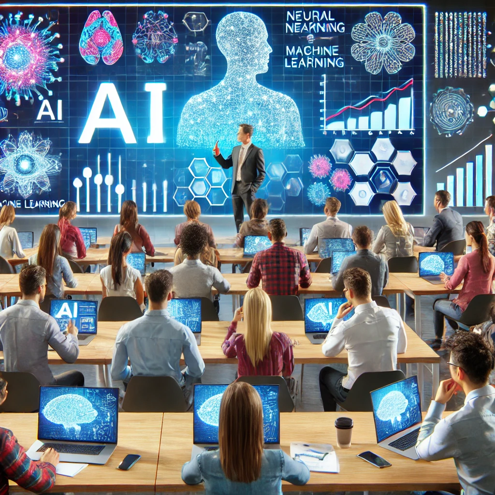

# masters-ai
First Lecture: Exploring Generative AI with a Purpose
Welcome to an Exciting Learning Journey
Our first lecture set the tone for an exciting semester ahead. We started by getting to know the instructor, who shared a rich 13-year journey from software testing to leading AI-driven educational initiatives. With experience spanning global teaching and cutting-edge AI engineering, the session promised deep insights and practical knowledge.

The Course Structure
The lecture introduced the key components of the course:

Session Themes: From AI and ML fundamentals to advanced topics like LLMs and image generation.
Assignments: Practical tasks focused on applying concepts, culminating in a Capstone project.
Tools: GitHub for task submissions, Python for coding, and frameworks like PyTorch for ML experiments.
Course Structure Overview

Understanding AI and ML
One of the lecture's highlights was a discussion on the definitions and relationships among AI, ML, and NLP. The instructor explained:

AI: Systems mimicking human behavior.
ML: Algorithms that learn from data, forming the backbone of modern AI.
NLP: Techniques to process human language, critical for LLMs.
Classroom Learning

Practical Insights and Tips
Students were encouraged to:

Leverage tools like PyTorch for ML experimentation.
Explore foundational AI models like GPT, Lama, and others for practical applications.
Focus on practical coding tasks and prompt engineering.
Comments for the Task
Review the concepts of AI, ML, and NLP discussed in this lecture.
Experiment with PyTorch to get familiar with its framework as it will be used in upcoming assignments.
Complete the GitHub repository setup for assignment submissions.
Begin brainstorming ideas for the Capstone project to ensure preparedness.
Stay tuned for more updates as we explore the world of generative AI!

